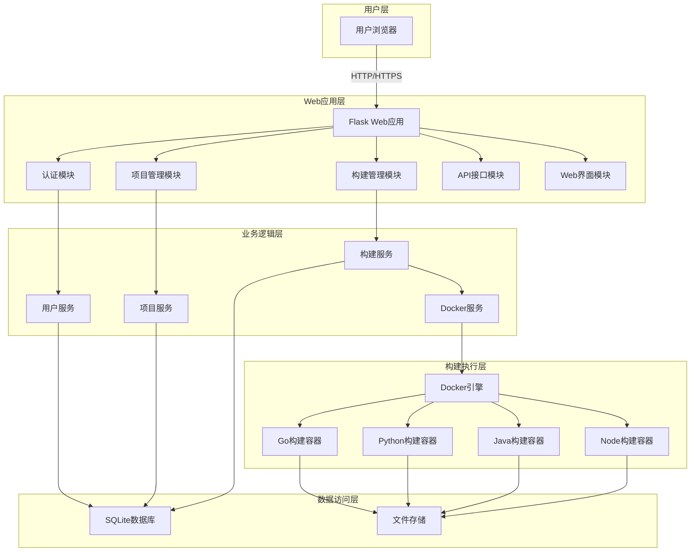
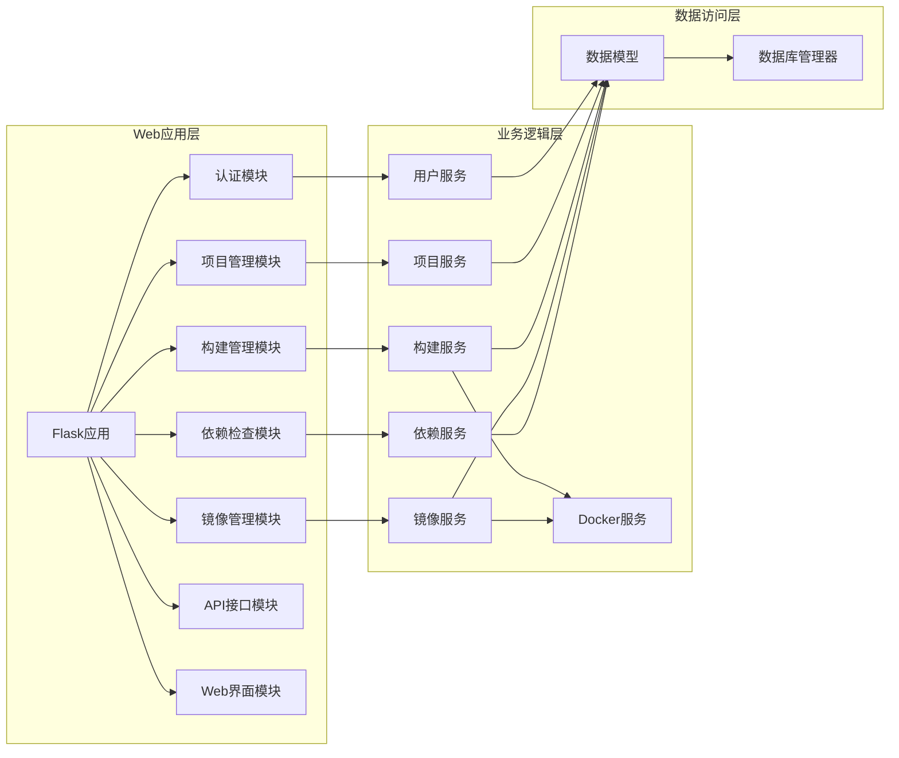
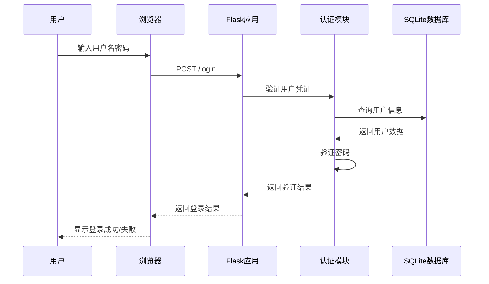
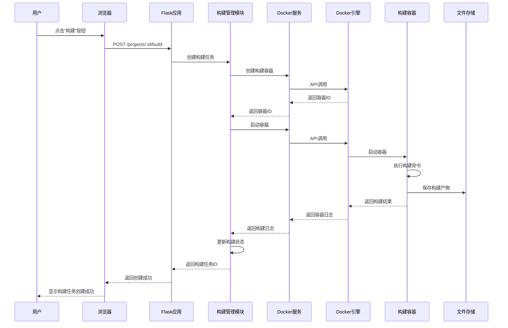
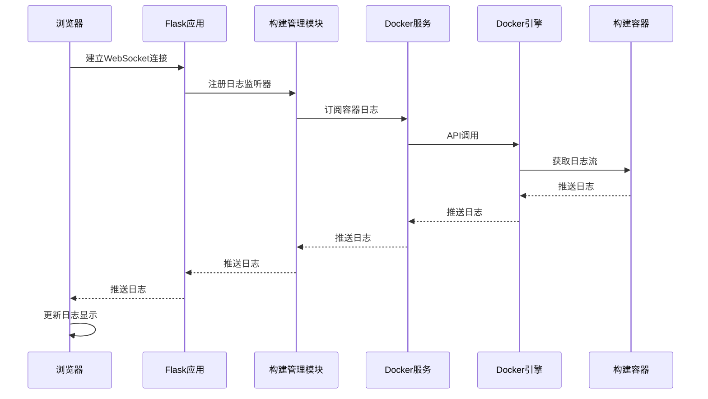

# DESIGN_需求分析.md

## 1. 整体架构设计

### 1.1 系统架构图



### 1.2 分层设计

#### 表现层（Presentation Layer）
- **Web界面模块**: 提供HTML页面和静态资源
- **API接口模块**: 提供RESTful API接口

#### 应用层（Application Layer）
- **认证模块**: 处理用户认证和授权
- **项目管理模块**: 处理项目相关的业务逻辑
- **构建管理模块**: 处理构建任务相关的业务逻辑

#### 业务逻辑层（Business Logic Layer）
- **用户服务**: 用户相关的业务逻辑
- **项目服务**: 项目相关的业务逻辑
- **构建服务**: 构建任务相关的业务逻辑
- **Docker服务**: Docker容器管理相关的业务逻辑

#### 数据访问层（Data Access Layer）
- **SQLite数据库**: 数据持久化
- **文件存储**: 构建产物和日志文件存储

#### 基础设施层（Infrastructure Layer）
- **Docker引擎**: 容器运行时
- **文件系统**: 本地文件系统

## 2. 核心组件设计

### 2.1 Flask应用主程序（app.py）

**职责**:
- 应用初始化和配置
- 路由注册
- 中间件配置
- 全局异常处理

**主要方法**:
- `create_app()`: 应用工厂函数
- `init_db()`: 数据库初始化
- `init_docker()`: Docker客户端初始化

### 2.2 认证模块（auth.py）

**职责**:
- 用户登录/登出
- 会话管理
- 密码加密/验证
- 权限检查

**主要类**:
- `User`: 用户模型
- `LoginForm`: 登录表单
- `LoginManager`: Flask-Login管理器

**主要方法**:
- `login_user()`: 用户登录
- `logout_user()`: 用户登出
- `hash_password()`: 密码加密
- `verify_password()`: 密码验证

### 2.3 项目管理模块（project.py）

**职责**:
- 项目CRUD操作
- 项目配置解析（YAML）
- 项目配置验证
- 配置导入导出

**主要类**:
- `Project`: 项目模型
- `ProjectForm`: 项目表单
- `ProjectConfig`: 项目配置类

**主要方法**:
- `create_project()`: 创建项目
- `update_project()`: 更新项目
- `delete_project()`: 删除项目
- `get_project()`: 获取项目
- `list_projects()`: 列出项目
- `parse_config()`: 解析配置
- `validate_config()`: 验证配置
- `export_config()`: 导出配置
- `import_config()`: 导入配置

### 2.4 构建管理模块（build.py）

**职责**:
- 构建任务创建
- 构建任务调度
- 构建状态管理
- 构建日志收集
- 构建产物管理

**主要类**:
- `BuildTask`: 构建任务模型
- `BuildService`: 构建服务类
- `BuildStatus`: 构建状态枚举

**主要方法**:
- `create_build_task()`: 创建构建任务
- `start_build()`: 启动构建
- `cancel_build()`: 取消构建
- `get_build_status()`: 获取构建状态
- `get_build_log()`: 获取构建日志
- `get_build_artifacts()`: 获取构建产物
- `cleanup_build()`: 清理构建资源

### 2.5 Docker集成模块（docker_client.py）

**职责**:
- Docker容器管理
- 容器日志流式读取
- 容器资源管理
- 镜像管理

**主要类**:
- `DockerClient`: Docker客户端封装
- `ContainerManager`: 容器管理器
- `ImageManager`: 镜像管理器

**主要方法**:
- `create_container()`: 创建容器
- `start_container()`: 启动容器
- `stop_container()`: 停止容器
- `remove_container()`: 删除容器
- `get_container_logs()`: 获取容器日志
- `stream_container_logs()`: 流式获取容器日志
- `pull_image()`: 拉取镜像
- `build_image()`: 构建镜像

### 2.6 镜像管理模块（image_manager.py）（新增）

**职责**:
- 基于dockcross镜像创建自定义构建镜像
- 添加自定义依赖到镜像中
- 打包新的镜像
- 镜像CRUD操作
- 镜像Dockerfile生成

**主要类**:
- `CustomImage`: 自定义镜像模型
- `ImageManager`: 镜像管理器
- `DockerfileGenerator`: Dockerfile生成器

**主要方法**:
- `create_custom_image()`: 创建自定义镜像
- `update_custom_image()`: 更新自定义镜像
- `delete_custom_image()`: 删除自定义镜像
- `get_custom_image()`: 获取自定义镜像
- `list_custom_images()`: 列出自定义镜像
- `build_custom_image()`: 构建自定义镜像
- `generate_dockerfile()`: 生成Dockerfile
- `add_dependency()`: 添加依赖
- `remove_dependency()`: 移除依赖

### 2.7 依赖检查模块（dependency_checker.py）（新增）

**职责**:
- 检查系统依赖
- 自动安装系统依赖
- 提供依赖安装提示
- 显示依赖检查结果

**主要类**:
- `DependencyChecker`: 依赖检查器
- `Dependency`: 依赖模型
- `DependencyInstaller`: 依赖安装器

**主要方法**:
- `check_dependencies()`: 检查所有依赖
- `check_dependency()`: 检查单个依赖
- `install_dependency()`: 安装依赖
- `install_dependencies()`: 安装所有依赖
- `get_dependency_status()`: 获取依赖状态
- `get_install_command()`: 获取安装命令
- `is_auto_install_supported()`: 检查是否支持自动安装

### 2.8 数据访问层（models.py, database.py）

**职责**:
- 数据库连接管理
- 数据模型定义
- CRUD操作
- 数据库迁移

**主要类**:
- `Base`: SQLAlchemy基类
- `User`: 用户模型
- `Project`: 项目模型
- `BuildTask`: 构建任务模型
- `CustomImage`: 自定义镜像模型（新增）
- `DependencyCheck`: 依赖检查模型（新增）
- `Database`: 数据库管理器

**主要方法**:
- `init_db()`: 初始化数据库
- `create_tables()`: 创建表
- `drop_tables()`: 删除表
- `get_session()`: 获取数据库会话

### 2.9 Web界面模块（templates/, static/）

**职责**:
- HTML模板渲染
- 静态资源管理
- 前端交互逻辑
- WebSocket连接管理

**主要页面**:
- `login.html`: 登录页面
- `projects.html`: 项目列表页面
- `project_detail.html`: 项目详情页面
- `builds.html`: 构建任务列表页面
- `build_detail.html`: 构建任务详情页面
- `images.html`: 自定义镜像列表页面（新增）
- `image_detail.html`: 自定义镜像详情页面（新增）
- `image_create.html`: 创建自定义镜像页面（新增）
- `dependency_check.html`: 依赖检查页面（新增）

**主要静态资源**:
- `css/`: 样式文件
- `js/`: JavaScript文件
- `img/`: 图片资源

## 3. 模块依赖关系图



## 4. 接口契约定义

### 4.1 RESTful API接口

#### 认证接口

**POST /api/login**
- 描述: 用户登录
- 请求体:
```json
{
  "username": "string",
  "password": "string"
}
```
- 响应:
```json
{
  "success": true,
  "message": "登录成功",
  "data": {
    "user_id": 1,
    "username": "admin"
  }
}
```

**POST /api/logout**
- 描述: 用户登出
- 响应:
```json
{
  "success": true,
  "message": "登出成功"
}
```

#### 项目接口

**GET /api/projects**
- 描述: 获取项目列表
- 查询参数:
  - `page`: 页码（默认1）
  - `per_page`: 每页数量（默认10）
- 响应:
```json
{
  "success": true,
  "data": {
    "projects": [
      {
        "id": 1,
        "name": "my-project",
        "description": "项目描述",
        "language": "go",
        "target_platform": "linux",
        "created_at": "2026-03-25T10:00:00Z"
      }
    ],
    "total": 1,
    "page": 1,
    "per_page": 10
  }
}
```

**GET /api/projects/:id**
- 描述: 获取项目详情
- 响应:
```json
{
  "success": true,
  "data": {
    "id": 1,
    "name": "my-project",
    "description": "项目描述",
    "repository_url": "https://github.com/user/repo",
    "language": "go",
    "build_command": "go build -o app",
    "target_platform": "linux",
    "config_yaml": "...",
    "created_at": "2026-03-25T10:00:00Z",
    "updated_at": "2026-03-25T10:00:00Z"
  }
}
```

**POST /api/projects**
- 描述: 创建项目
- 请求体:
```json
{
  "name": "my-project",
  "description": "项目描述",
  "repository_url": "https://github.com/user/repo",
  "language": "go",
  "build_command": "go build -o app",
  "target_platform": "linux"
}
```
- 响应:
```json
{
  "success": true,
  "message": "项目创建成功",
  "data": {
    "id": 1,
    "name": "my-project"
  }
}
```

**PUT /api/projects/:id**
- 描述: 更新项目
- 请求体: 同创建项目
- 响应:
```json
{
  "success": true,
  "message": "项目更新成功",
  "data": {
    "id": 1,
    "name": "my-project"
  }
}
```

**DELETE /api/projects/:id**
- 描述: 删除项目
- 响应:
```json
{
  "success": true,
  "message": "项目删除成功"
}
```

**POST /api/projects/:id/import**
- 描述: 导入项目配置
- 请求体:
```json
{
  "config_yaml": "..."
}
```
- 响应:
```json
{
  "success": true,
  "message": "配置导入成功"
}
```

**GET /api/projects/:id/export**
- 描述: 导出项目配置
- 响应:
```json
{
  "success": true,
  "data": {
    "config_yaml": "..."
  }
}
```

#### 构建接口

**GET /api/projects/:project_id/builds**
- 描述: 获取项目的构建任务列表
- 查询参数:
  - `page`: 页码（默认1）
  - `per_page`: 每页数量（默认10）
  - `status`: 状态筛选（可选）
- 响应:
```json
{
  "success": true,
  "data": {
    "builds": [
      {
        "id": 1,
        "project_id": 1,
        "status": "running",
        "start_time": "2026-03-25T10:00:00Z",
        "end_time": null,
        "created_at": "2026-03-25T10:00:00Z"
      }
    ],
    "total": 1,
    "page": 1,
    "per_page": 10
  }
}
```

**GET /api/builds/:id**
- 描述: 获取构建任务详情
- 响应:
```json
{
  "success": true,
  "data": {
    "id": 1,
    "project_id": 1,
    "status": "success",
    "container_id": "abc123",
    "start_time": "2026-03-25T10:00:00Z",
    "end_time": "2026-03-25T10:05:00Z",
    "output_log": "...",
    "error_log": null,
    "artifacts_path": "/artifacts/build_1",
    "created_at": "2026-03-25T10:00:00Z"
  }
}
```

**POST /api/projects/:project_id/build**
- 描述: 创建构建任务
- 响应:
```json
{
  "success": true,
  "message": "构建任务创建成功",
  "data": {
    "build_id": 1,
    "status": "pending"
  }
}
```

**POST /api/builds/:id/cancel**
- 描述: 取消构建任务
- 响应:
```json
{
  "success": true,
  "message": "构建任务已取消"
}
```

**GET /api/builds/:id/log**
- 描述: 获取构建日志（流式）
- 响应: text/event-stream

**GET /api/builds/:id/download**
- 描述: 下载构建产物
- 响应: application/zip

#### 镜像管理接口（新增）

**GET /api/images**
- 描述: 获取自定义镜像列表
- 查询参数:
  - `page`: 页码（默认1）
  - `per_page`: 每页数量（默认10）
- 响应:
```json
{
  "success": true,
  "data": {
    "images": [
      {
        "id": 1,
        "name": "my-custom-image",
        "base_image": "dockcross/linux-x64",
        "description": "自定义构建镜像",
        "dependencies": ["cmake", "ninja"],
        "image_id": "sha256:abc123",
        "created_at": "2026-03-25T10:00:00Z"
      }
    ],
    "total": 1,
    "page": 1,
    "per_page": 10
  }
}
```

**GET /api/images/:id**
- 描述: 获取自定义镜像详情
- 响应:
```json
{
  "success": true,
  "data": {
    "id": 1,
    "name": "my-custom-image",
    "base_image": "dockcross/linux-x64",
    "description": "自定义构建镜像",
    "dependencies": ["cmake", "ninja"],
    "dockerfile": "FROM dockcross/linux-x64\nRUN apt-get update && apt-get install -y cmake ninja-build",
    "image_id": "sha256:abc123",
    "created_at": "2026-03-25T10:00:00Z",
    "updated_at": "2026-03-25T10:00:00Z"
  }
}
```

**POST /api/images**
- 描述: 创建自定义镜像
- 请求体:
```json
{
  "name": "my-custom-image",
  "base_image": "dockcross/linux-x64",
  "description": "自定义构建镜像",
  "dependencies": ["cmake", "ninja"]
}
```
- 响应:
```json
{
  "success": true,
  "message": "镜像创建成功",
  "data": {
    "image_id": 1,
    "status": "building"
  }
}
```

**PUT /api/images/:id**
- 描述: 更新自定义镜像
- 请求体: 同创建镜像
- 响应:
```json
{
  "success": true,
  "message": "镜像更新成功",
  "data": {
    "image_id": 1
  }
}
```

**DELETE /api/images/:id**
- 描述: 删除自定义镜像
- 响应:
```json
{
  "success": true,
  "message": "镜像删除成功"
}
```

**POST /api/images/:id/build**
- 描述: 构建自定义镜像
- 响应:
```json
{
  "success": true,
  "message": "镜像构建已启动",
  "data": {
    "build_id": 1,
    "status": "building"
  }
}
```

#### 依赖检查接口（新增）

**GET /api/dependencies**
- 描述: 获取依赖检查结果
- 响应:
```json
{
  "success": true,
  "data": {
    "dependencies": [
      {
        "id": 1,
        "dependency_name": "docker",
        "dependency_type": "system",
        "is_installed": true,
        "version": "20.10.0",
        "check_time": "2026-03-25T10:00:00Z",
        "auto_install_supported": true,
        "install_command": "apt-get install -y docker.io"
      }
    ]
  }
}
```

**POST /api/dependencies/check**
- 描述: 检查所有依赖
- 响应:
```json
{
  "success": true,
  "message": "依赖检查完成",
  "data": {
    "total": 5,
    "installed": 3,
    "missing": 2
  }
}
```

**POST /api/dependencies/install**
- 描述: 安装缺失的依赖
- 请求体:
```json
{
  "dependency_ids": [1, 2, 3]
}
```
- 响应:
```json
{
  "success": true,
  "message": "依赖安装已启动",
  "data": {
    "install_id": 1,
    "status": "installing"
  }
}
```

**GET /api/dependencies/:id/install-status**
- 描述: 获取依赖安装状态
- 响应:
```json
{
  "success": true,
  "data": {
    "install_id": 1,
    "status": "completed",
    "progress": 100,
    "message": "安装完成"
  }
}
```

### 4.2 WebSocket接口

**WS /ws/builds/:id/log**
- 描述: 实时推送构建日志
- 消息格式:
```json
{
  "type": "log",
  "data": "构建日志内容",
  "timestamp": "2026-03-25T10:00:00Z"
}
```

## 5. 数据流向图

### 5.1 用户登录流程



### 5.2 创建构建任务流程



### 5.3 实时日志推送流程



## 6. 异常处理策略

### 6.1 异常分类

#### 业务异常
- `UserNotFoundException`: 用户不存在
- `InvalidPasswordException`: 密码错误
- `ProjectNotFoundException`: 项目不存在
- `BuildNotFoundException`: 构建任务不存在
- `InvalidConfigException`: 配置无效
- `BuildFailedException`: 构建失败

#### 系统异常
- `DatabaseException`: 数据库异常
- `DockerException`: Docker异常
- `ContainerException`: 容器异常
- `NetworkException`: 网络异常

#### 认证异常
- `UnauthorizedException`: 未授权
- `SessionExpiredException`: 会话过期

### 6.2 异常处理机制

#### 全局异常处理器
```python
@app.errorhandler(Exception)
def handle_exception(e):
    if isinstance(e, BusinessException):
        return jsonify({
            "success": False,
            "message": str(e),
            "error_code": e.error_code
        }), e.status_code
    elif isinstance(e, SystemException):
        logger.error(f"System error: {str(e)}")
        return jsonify({
            "success": False,
            "message": "系统错误，请稍后重试",
            "error_code": "SYSTEM_ERROR"
        }), 500
    else:
        logger.error(f"Unexpected error: {str(e)}")
        return jsonify({
            "success": False,
            "message": "未知错误",
            "error_code": "UNKNOWN_ERROR"
        }), 500
```

#### 构建任务异常处理
- 构建失败时记录错误日志
- 更新构建状态为失败
- 保存错误日志到数据库
- 清理容器资源
- 通知用户构建失败

#### Docker异常处理
- 容器创建失败时重试（最多3次）
- 容器启动失败时清理资源
- 容器运行超时时强制停止
- 记录详细的错误信息

### 6.3 错误码定义

| 错误码 | 描述 | HTTP状态码 |
|--------|------|------------|
| SUCCESS | 成功 | 200 |
| UNAUTHORIZED | 未授权 | 401 |
| NOT_FOUND | 资源不存在 | 404 |
| INVALID_PARAMS | 参数错误 | 400 |
| USER_NOT_FOUND | 用户不存在 | 404 |
| INVALID_PASSWORD | 密码错误 | 401 |
| PROJECT_NOT_FOUND | 项目不存在 | 404 |
| BUILD_NOT_FOUND | 构建任务不存在 | 404 |
| INVALID_CONFIG | 配置无效 | 400 |
| BUILD_FAILED | 构建失败 | 500 |
| DOCKER_ERROR | Docker错误 | 500 |
| DATABASE_ERROR | 数据库错误 | 500 |
| SYSTEM_ERROR | 系统错误 | 500 |
| UNKNOWN_ERROR | 未知错误 | 500 |

## 7. 安全设计

### 7.1 认证安全
- 密码使用bcrypt加密存储
- 会话使用Flask-Login管理
- 会话超时时间：24小时
- 防止会话固定攻击

### 7.2 输入验证
- 所有用户输入进行验证
- 使用Werkzeug的验证器
- 防止SQL注入（使用ORM）
- 防止XSS攻击（转义输出）

### 7.3 Docker安全
- 容器使用非root用户运行
- 容器资源限制（CPU、内存）
- 容器网络隔离
- 定期清理过期容器

### 7.4 文件安全
- 构建产物存储在独立目录
- 文件权限控制
- 定期清理过期文件
- 防止路径遍历攻击

## 8. 性能优化

### 8.1 数据库优化
- 为常用查询字段添加索引
- 使用连接池
- 定期清理过期数据

### 8.2 构建优化
- 并发构建限制（最多3个）
- 构建任务队列管理
- 容器资源复用

### 8.3 日志优化
- 日志分级（DEBUG、INFO、WARNING、ERROR）
- 日志文件轮转
- 异步日志写入

### 8.4 前端优化
- 静态资源压缩
- CDN加速（可选）
- 前端缓存

## 9. 部署架构

### 9.1 单机部署架构

```
┌─────────────────────────────────────┐
│         服务器/开发机                │
│                                     │
│  ┌──────────────────────────────┐  │
│  │   Docker容器                 │  │
│  │   - Flask应用                │  │
│  │   - SQLite数据库             │  │
│  │   - 构建产物存储             │  │
│  └──────────────────────────────┘  │
│                                     │
│  ┌──────────────────────────────┐  │
│  │   Docker引擎                 │  │
│  │   - 构建容器                 │  │
│  └──────────────────────────────┘  │
│                                     │
│  端口映射: 5000 -> 5000             │
└─────────────────────────────────────┘
```

### 9.2 Docker镜像结构

```
easydockcross/
├── app/                    # 应用代码
│   ├── __init__.py
│   ├── app.py
│   ├── models.py
│   ├── auth.py
│   ├── project.py
│   ├── build.py
│   ├── docker_client.py
│   └── utils.py
├── templates/              # HTML模板
├── static/                 # 静态资源
├── data/                   # 数据目录
│   ├── database.db
│   ├── artifacts/
│   └── logs/
├── requirements.txt        # Python依赖
├── Dockerfile             # Docker镜像定义
├── docker-compose.yml     # Docker Compose配置
└── scripts/               # 部署脚本
    ├── build.sh
    └── deploy.sh
```

---

**文档状态**: 已完成
**创建时间**: 2026-03-25
**更新时间**: 2026-03-25
