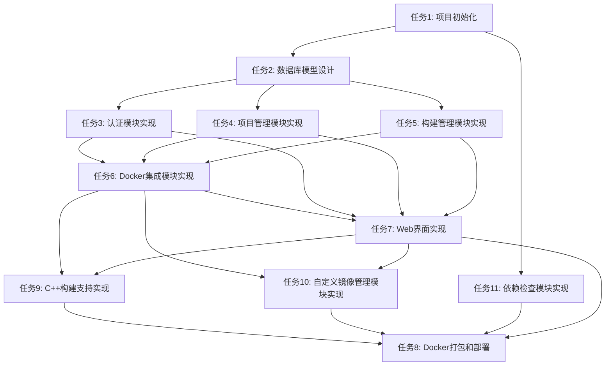

# TASK_需求分析.md

## 任务依赖图

## 原子任务列表

### 任务1: 项目初始化

**任务ID**: TASK-001
**任务名称**: 项目初始化和基础框架搭建
**优先级**: 高

#### 输入契约
- **前置依赖**: 无
- **输入数据**: 项目需求文档
- **环境依赖**:
  - Python 3.8+
  - Git

#### 输出契约
- **输出数据**:
  - 项目目录结构
  - requirements.txt文件
  - .gitignore文件
  - 基础配置文件（config.py）
  - 应用工厂函数（app.py）
- **交付物**:
  - 完整的项目目录结构
  - 可运行的Flask应用骨架
- **验收标准**:
  - [ ] 项目目录结构符合设计文档
  - [ ] requirements.txt包含所有必需的依赖
  - [ ] Flask应用可以正常启动
  - [ ] 访问根路径返回200状态码

#### 实现约束
- **技术栈**: Python 3.8+, Flask
- **接口规范**: 遵循Flask最佳实践
- **质量要求**:
  - 代码符合PEP 8规范
  - 添加必要的注释
  - 使用应用工厂模式

#### 依赖关系
- **后置任务**: TASK-002, TASK-003, TASK-004, TASK-005
- **并行任务**: 无

---

### 任务2: 数据库模型设计

**任务ID**: TASK-002
**任务名称**: 数据库模型设计和实现
**优先级**: 高

#### 输入契约
- **前置依赖**: TASK-001
- **输入数据**: 数据模型设计文档
- **环境依赖**:
  - Flask应用已初始化
  - SQLAlchemy已安装

#### 输出契约
- **输出数据**:
  - models.py文件（包含User、Project、BuildTask模型）
  - database.py文件（数据库管理器）
  - 数据库初始化脚本
- **交付物**:
  - 完整的数据模型定义
  - 数据库初始化功能
- **验收标准**:
  - [ ] User模型包含id、username、password_hash、created_at字段
  - [ ] Project模型包含id、name、description、repository_url、language、build_command、target_platform、config_yaml、created_at、updated_at字段
  - [ ] BuildTask模型包含id、project_id、status、container_id、start_time、end_time、output_log、error_log、artifacts_path、created_at字段
  - [ ] 数据库可以成功初始化
  - [ ] 所有表可以正确创建
  - [ ] 外键关系正确建立

#### 实现约束
- **技术栈**: SQLAlchemy, SQLite
- **接口规范**: 遵循SQLAlchemy ORM最佳实践
- **质量要求**:
  - 使用declarative_base定义模型
  - 添加必要的索引
  - 添加外键约束
  - 添加数据验证

#### 依赖关系
- **后置任务**: TASK-003, TASK-004, TASK-005
- **并行任务**: 无

---

### 任务3: 认证模块实现

**任务ID**: TASK-003
**任务名称**: 用户认证模块实现
**优先级**: 高

#### 输入契约
- **前置依赖**: TASK-001, TASK-002
- **输入数据**: 认证模块设计文档
- **环境依赖**:
  - Flask应用已初始化
  - 数据库模型已定义
  - Flask-Login已安装

#### 输出契约
- **输出数据**:
  - auth.py文件（认证模块）
  - 登录页面模板（login.html）
  - 登录路由和API接口
- **交付物**:
  - 完整的用户认证功能
  - 登录/登出功能
  - 会话管理功能
- **验收标准**:
  - [ ] 用户可以使用用户名密码登录
  - [ ] 登录成功后跳转到项目列表页面
  - [ ] 未登录用户访问受保护页面时重定向到登录页
  - [ ] 用户可以登出
  - [ ] 密码使用bcrypt加密存储
  - [ ] 会话超时时间为24小时

#### 实现约束
- **技术栈**: Flask-Login, bcrypt
- **接口规范**:
  - POST /api/login - 用户登录
  - POST /api/logout - 用户登出
- **质量要求**:
  - 密码加密使用bcrypt
  - 使用Flask-Login管理会话
  - 添加登录装饰器
  - 防止会话固定攻击

#### 依赖关系
- **后置任务**: TASK-007
- **并行任务**: TASK-004, TASK-005

---

### 任务4: 项目管理模块实现

**任务ID**: TASK-004
**任务名称**: 项目管理模块实现
**优先级**: 高

#### 输入契约
- **前置依赖**: TASK-001, TASK-002
- **输入数据**: 项目管理模块设计文档
- **环境依赖**:
  - Flask应用已初始化
  - 数据库模型已定义
  - PyYAML已安装

#### 输出契约
- **输出数据**:
  - project.py文件（项目管理模块）
  - 项目列表页面模板（projects.html）
  - 项目详情页面模板（project_detail.html）
  - 项目CRUD路由和API接口
- **交付物**:
  - 完整的项目管理功能
  - 项目CRUD操作
  - 配置导入导出功能
- **验收标准**:
  - [ ] 用户可以创建新项目
  - [ ] 用户可以查看项目列表
  - [ ] 用户可以编辑项目配置
  - [ ] 用户可以删除项目
  - [ ] 用户可以通过Web界面配置项目
  - [ ] 用户可以导入YAML配置文件
  - [ ] 用户可以导出项目配置为YAML文件
  - [ ] 项目配置验证正确

#### 实现约束
- **技术栈**: PyYAML, Flask-WTF
- **接口规范**:
  - GET /api/projects - 获取项目列表
  - GET /api/projects/:id - 获取项目详情
  - POST /api/projects - 创建项目
  - PUT /api/projects/:id - 更新项目
  - DELETE /api/projects/:id - 删除项目
  - POST /api/projects/:id/import - 导入配置
  - GET /api/projects/:id/export - 导出配置
- **质量要求**:
  - 使用表单验证
  - 添加配置验证逻辑
  - 使用YAML格式存储配置
  - 添加错误处理

#### 依赖关系
- **后置任务**: TASK-007
- **并行任务**: TASK-003, TASK-005

---

### 任务5: 构建管理模块实现

**任务ID**: TASK-005
**任务名称**: 构建管理模块实现
**优先级**: 高

#### 输入契约
- **前置依赖**: TASK-001, TASK-002
- **输入数据**: 构建管理模块设计文档
- **环境依赖**:
  - Flask应用已初始化
  - 数据库模型已定义
  - docker-py已安装

#### 输出契约
- **输出数据**:
  - build.py文件（构建管理模块）
  - 构建任务列表页面模板（builds.html）
  - 构建任务详情页面模板（build_detail.html）
  - 构建任务路由和API接口
- **交付物**:
  - 完整的构建任务管理功能
  - 构建任务创建和调度
  - 构建状态管理
  - 构建日志收集
- **验收标准**:
  - [ ] 用户可以为项目创建构建任务
  - [ ] 用户可以查看构建任务列表
  - [ ] 用户可以查看构建任务详情
  - [ ] 用户可以取消正在运行的构建任务
  - [ ] 构建状态正确更新（pending、running、success、failed、cancelled）
  - [ ] 构建日志正确收集和存储

#### 实现约束
- **技术栈**: docker-py, threading
- **接口规范**:
  - GET /api/projects/:project_id/builds - 获取构建任务列表
  - GET /api/builds/:id - 获取构建任务详情
  - POST /api/projects/:project_id/build - 创建构建任务
  - POST /api/builds/:id/cancel - 取消构建任务
  - GET /api/builds/:id/log - 获取构建日志
  - GET /api/builds/:id/download - 下载构建产物
- **质量要求**:
  - 使用线程池管理构建任务
  - 并发构建限制为3个
  - 添加构建超时处理
  - 添加错误处理和日志记录

#### 依赖关系
- **后置任务**: TASK-006, TASK-007
- **并行任务**: TASK-003, TASK-004

---

### 任务6: Docker集成模块实现

**任务ID**: TASK-006
**任务名称**: Docker集成模块实现
**优先级**: 高

#### 输入契约
- **前置依赖**: TASK-001, TASK-002, TASK-003, TASK-004, TASK-005
- **输入数据**: Docker集成模块设计文档
- **环境依赖**:
  - Flask应用已初始化
  - 数据库模型已定义
  - docker-py已安装
  - Docker引擎已安装并运行

#### 输出契约
- **输出数据**:
  - docker_client.py文件（Docker客户端封装）
  - 构建容器配置
  - 构建脚本模板
- **交付物**:
  - 完整的Docker集成功能
  - 容器创建和管理
  - 容器日志流式读取
  - 构建产物收集
- **验收标准**:
  - [ ] 可以为Go项目创建构建容器并执行构建
  - [ ] 可以为Python项目创建构建容器并执行构建
  - [ ] 可以为Java项目创建构建容器并执行构建
  - [ ] 可以为Node.js项目创建构建容器并执行构建
  - [ ] 容器日志可以实时读取
  - [ ] 构建产物可以正确收集
  - [ ] 容器资源正确清理
  - [ ] 支持多操作系统目标平台（Linux、Windows、macOS）

#### 实现约束
- **技术栈**: docker-py, Docker
- **接口规范**:
  - create_container() - 创建容器
  - start_container() - 启动容器
  - stop_container() - 停止容器
  - remove_container() - 删除容器
  - get_container_logs() - 获取容器日志
  - stream_container_logs() - 流式获取容器日志
- **质量要求**:
  - 使用官方Docker镜像
  - 容器使用非root用户运行
  - 添加容器资源限制
  - 添加容器超时处理
  - 添加错误处理和重试机制

#### 依赖关系
- **后置任务**: TASK-007
- **并行任务**: 无

---

### 任务7: Web界面实现

**任务ID**: TASK-007
**任务名称**: Web界面实现和完善
**优先级**: 高

#### 输入契约
- **前置依赖**: TASK-001, TASK-002, TASK-003, TASK-004, TASK-005, TASK-006
- **输入数据**: Web界面设计文档
- **环境依赖**:
  - Flask应用已初始化
  - 所有后端模块已实现
  - Bootstrap 5已安装

#### 输出契约
- **输出数据**:
  - 完整的HTML模板
  - CSS样式文件
  - JavaScript文件
  - 静态资源
- **交付物**:
  - 完整的Web界面
  - 响应式设计
  - 实时日志显示
  - 构建进度显示
- **验收标准**:
  - [ ] 登录页面正常显示和工作
  - [ ] 项目列表页面正常显示
  - [ ] 项目详情页面正常显示
  - [ ] 构建任务列表页面正常显示
  - [ ] 构建任务详情页面正常显示，包含进度和日志
  - [ ] 构建进度实时更新
  - [ ] 构建日志实时显示
  - [ ] 页面响应式设计，支持移动端
  - [ ] 在Chrome、Firefox、Edge、Safari浏览器上正常工作

#### 实现约束
- **技术栈**: Bootstrap 5, jQuery, Jinja2
- **接口规范**:
  - 使用Jinja2模板引擎
  - 使用Bootstrap 5框架
  - 使用jQuery处理AJAX请求
  - 使用WebSocket实时推送日志
- **质量要求**:
  - 界面美观、易用
  - 响应式设计
  - 添加加载动画
  - 添加错误提示
  - 添加确认对话框

#### 依赖关系
- **后置任务**: TASK-009, TASK-010, TASK-011
- **并行任务**: 无

---

### 任务9: C++构建支持实现

**任务ID**: TASK-009
**任务名称**: C++构建支持实现
**优先级**: 高

#### 输入契约
- **前置依赖**: TASK-001, TASK-002, TASK-003, TASK-004, TASK-005, TASK-006, TASK-007
- **输入数据**: C++构建支持设计文档
- **环境依赖**:
  - Flask应用已初始化
  - 所有后端模块已实现
  - Docker引擎已安装并运行

#### 输出契约
- **输出数据**:
  - C++构建配置文件
  - C++构建脚本模板
  - C++构建支持代码
- **交付物**:
  - 完整的C++构建支持
  - 支持cmake、xmake、make构建工具
- **验收标准**:
  - [ ] 系统可以为C++项目创建构建容器并执行构建
  - [ ] C++项目支持cmake构建工具
  - [ ] C++项目支持xmake构建工具
  - [ ] C++项目支持make构建工具
  - [ ] 支持指定构建工具类型
  - [ ] 支持自定义构建参数
  - [ ] 构建产物正确收集

#### 实现约束
- **技术栈**: Docker, Python
- **接口规范**:
  - 支持cmake、xmake、make构建工具
  - 使用dockcross镜像作为基础镜像
  - 支持多平台交叉编译
- **质量要求**:
  - 构建配置灵活
  - 支持自定义构建参数
  - 错误处理完善
  - 日志记录详细

#### 依赖关系
- **后置任务**: TASK-008
- **并行任务**: TASK-010, TASK-011

---

### 任务10: 自定义镜像管理模块实现

**任务ID**: TASK-010
**任务名称**: 自定义镜像管理模块实现
**优先级**: 高

#### 输入契约
- **前置依赖**: TASK-001, TASK-002, TASK-003, TASK-004, TASK-005, TASK-006, TASK-007
- **输入数据**: 自定义镜像管理设计文档
- **环境依赖**:
  - Flask应用已初始化
  - 所有后端模块已实现
  - Docker引擎已安装并运行

#### 输出契约
- **输出数据**:
  - image_manager.py文件（镜像管理模块）
  - 自定义镜像列表页面模板（images.html）
  - 自定义镜像详情页面模板（image_detail.html）
  - 创建自定义镜像页面模板（image_create.html）
  - 镜像管理路由和API接口
- **交付物**:
  - 完整的自定义镜像管理功能
  - 基于dockcross创建自定义镜像
  - 添加自定义依赖到镜像
  - 打包新的镜像
- **验收标准**:
  - [ ] 用户可以基于dockcross镜像创建自定义构建镜像
  - [ ] 用户可以添加自定义依赖到镜像中
  - [ ] 用户可以打包新的镜像
  - [ ] 用户可以在项目配置中指定使用的镜像
  - [ ] 用户可以查看已创建的镜像列表
  - [ ] 用户可以删除自定义镜像
  - [ ] 镜像管理界面正常工作
  - [ ] Dockerfile自动生成正确

#### 实现约束
- **技术栈**: docker-py, Flask
- **接口规范**:
  - GET /api/images - 获取自定义镜像列表
  - GET /api/images/:id - 获取自定义镜像详情
  - POST /api/images - 创建自定义镜像
  - PUT /api/images/:id - 更新自定义镜像
  - DELETE /api/images/:id - 删除自定义镜像
  - POST /api/images/:id/build - 构建自定义镜像
- **质量要求**:
  - Dockerfile生成正确
  - 镜像构建稳定
  - 依赖管理灵活
  - 错误处理完善

#### 依赖关系
- **后置任务**: TASK-008
- **并行任务**: TASK-009, TASK-011

---

### 任务11: 依赖检查模块实现

**任务ID**: TASK-011
**任务名称**: 依赖检查模块实现
**优先级**: 高

#### 输入契约
- **前置依赖**: TASK-001
- **输入数据**: 依赖检查设计文档
- **环境依赖**:
  - Flask应用已初始化
  - Python 3.8+已安装

#### 输出契约
- **输出数据**:
  - dependency_checker.py文件（依赖检查模块）
  - 依赖检查页面模板（dependency_check.html）
  - 依赖检查路由和API接口
  - 依赖安装脚本
- **交付物**:
  - 完整的依赖检查功能
  - 自动安装系统依赖
  - 依赖安装提示引导
- **验收标准**:
  - [ ] 第一次启动时自动检查系统依赖
  - [ ] 系统可以自动安装Docker等系统依赖
  - [ ] 无法自动安装的依赖提供清晰的提示引导
  - [ ] 显示依赖安装进度和结果
  - [ ] 依赖检查界面正常工作
  - [ ] 支持Windows、Linux、macOS平台的依赖检查
  - [ ] 依赖检查结果准确

#### 实现约束
- **技术栈**: Python, subprocess, platform
- **接口规范**:
  - GET /api/dependencies - 获取依赖检查结果
  - POST /api/dependencies/check - 检查所有依赖
  - POST /api/dependencies/install - 安装缺失的依赖
  - GET /api/dependencies/:id/install-status - 获取依赖安装状态
- **质量要求**:
  - 依赖检查准确
  - 自动安装安全
  - 提示信息清晰
  - 支持多平台
  - 错误处理完善

#### 依赖关系
- **后置任务**: TASK-008
- **并行任务**: TASK-009, TASK-010

---

### 任务8: Docker打包和部署

**任务ID**: TASK-008
**任务名称**: Docker打包和部署脚本
**优先级**: 高

#### 输入契约
- **前置依赖**: TASK-001, TASK-002, TASK-003, TASK-004, TASK-005, TASK-006, TASK-007
- **输入数据**: 部署设计文档
- **环境依赖**:
  - 完整的应用代码
  - Docker已安装

#### 输出契约
- **输出数据**:
  - Dockerfile文件
  - docker-compose.yml文件
  - 构建脚本（build.sh）
  - 部署脚本（deploy.sh）
  - README.md文档
- **交付物**:
  - 可运行的Docker镜像
  - 一键部署脚本
  - 部署文档
- **验收标准**:
  - [ ] Dockerfile可以成功构建镜像
  - [ ] docker-compose.yml可以正常启动应用
  - [ ] 构建脚本可以正常工作
  - [ ] 部署脚本可以正常工作
  - [ ] Docker镜像可以成功运行
  - [ ] 应用在Docker容器中正常工作
  - [ ] 提供清晰的部署文档
  - [ ] README.md包含完整的使用说明

#### 实现约束
- **技术栈**: Docker, Docker Compose, Shell
- **接口规范**:
  - 使用多阶段构建优化镜像大小
  - 使用官方Python基础镜像
  - 暴露5000端口
  - 挂载数据目录
- **质量要求**:
  - 镜像大小优化
  - 使用非root用户运行
  - 添加健康检查
  - 添加环境变量配置
  - 提供详细的部署文档

#### 依赖关系
- **后置任务**: 无
- **并行任务**: 无

---

## 任务执行顺序

### 第一批（可并行执行）
- TASK-001: 项目初始化
- TASK-011: 依赖检查模块实现（可以并行开始）

### 第二批（TASK-001完成后）
- TASK-002: 数据库模型设计

### 第三批（TASK-002完成后，可并行执行）
- TASK-003: 认证模块实现
- TASK-004: 项目管理模块实现
- TASK-005: 构建管理模块实现

### 第四批（TASK-003, TASK-004, TASK-005完成后）
- TASK-006: Docker集成模块实现

### 第五批（TASK-006完成后）
- TASK-007: Web界面实现

### 第六批（TASK-007完成后，可并行执行）
- TASK-009: C++构建支持实现
- TASK-010: 自定义镜像管理模块实现

### 第七批（TASK-009, TASK-010, TASK-011完成后）
- TASK-008: Docker打包和部署

## 质量门控

### 每个任务完成后必须满足
- 代码符合PEP 8规范
- 添加必要的注释
- 通过单元测试（如果有）
- 功能正常工作
- 无明显bug

### 每个阶段完成后必须满足
- 所有任务验收标准全部满足
- 代码审查通过
- 功能测试通过
- 文档更新完整

---

**文档状态**: 已完成
**创建时间**: 2026-03-25
**更新时间**: 2026-03-25
